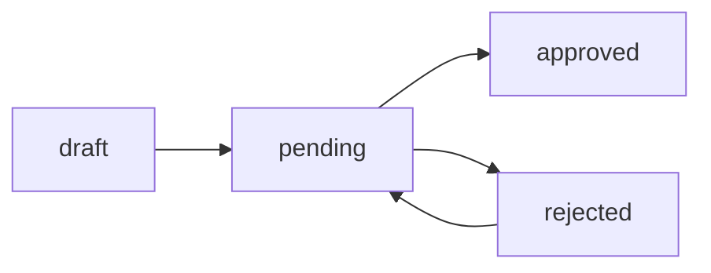

# 使用说明

这份文档只回答“怎么用这个项目”。

---

## 1. 项目是什么

Osmo 是一个基于 Laravel 13 + Inertia.js v3 + React 19 的 Pocket 3 创作内容平台。

它主要提供四类能力：

- 前台教程浏览
- 社区互动
- 工具箱与查阅工具
- 玩家投稿后台和运营管理后台

项目已经进入可持续迭代阶段。

---

## 2. 本地怎么启动

### 2.1 环境要求

- PHP 8.4+
- Composer
- Node.js 20+
- npm
- SQLite、MySQL 或 PostgreSQL

### 2.2 一键初始化

```bash
composer setup
```

### 2.3 手动初始化

```bash
composer install
cp .env.example .env
php artisan key:generate
touch database/database.sqlite
php artisan migrate
npm install
```

### 2.4 启动开发环境

```bash
composer run dev
```

如果页面改动没有立即显示，通常是前端构建没有刷新：

```bash
npm run dev
```

或者生产构建：

```bash
npm run build
```

---

## 3. 登录与角色

当前项目只有两种角色：

- `admin`：运营 / 管理员
- `player`：玩家 / 投稿用户

登录后系统会自动分流：

- `admin` 用户进入 `/admin`
- `player` 用户进入 `/contribute`

### 3.1 角色判断

角色由 `users.role` 控制。

相关位置：

- 用户模型
- 登录后的跳转逻辑
- 后台权限中间件或策略
- 前端页面的入口判断

新功能先确认给哪个角色看，再决定放前台、投稿台还是后台。

---

## 4. 前台怎么用

前台主要面向普通访问者和玩家，核心入口如下：

- 首页 `/`
- 教程列表 `/tutorials`
- 教程详情 `/tutorials/{tutorial}`
- 社区列表 `/community`
- 社区详情 `/community/{post}`
- 工具箱 `/tools`
- ND 计算器 `/tools/nd-calculator`
- 规格页 `/tools/specs`
- 配件页 `/tools/accessories`
- AI 助手页 `/assistant`
- 模拟器页 `/simulator`

### 4.1 首页

首页只做分流。

- 教程
- 工具
- 社区
- 投稿

默认节奏是：先看教程、再看工具、再看社区、最后去投稿。

### 4.2 教程详情页

教程详情页负责把内容和工具链路串起来。

- 教程摘要
- 参数信息
- 步骤说明
- 使用提示
- 到工具箱或模拟器的快捷入口

适合做的事：

- 看参数
- 复制参数
- 跳转工具校验
- 继续实践

### 4.3 社区页

社区页用于查看讨论、经验贴和解答。

- 看帖子
- 点赞
- 提交解答
- 浏览别人如何拍、如何踩坑

### 4.4 工具页

工具页用于参数计算、规格查询和拍摄辅助。

- ND 计算
- 规格核对
- 配件查看
- 拍摄前准备

---

## 5. 玩家投稿台怎么用

投稿台地址是 `/contribute`，只对 `player` 用户可见。

它负责管理你自己的教程投稿。

### 5.1 投稿状态

投稿有四个状态：

- `draft`：草稿
- `pending`：审核中
- `approved`：已通过
- `rejected`：已驳回

### 5.2 投稿台里能做什么

- 新建投稿
- 编辑草稿
- 删除草稿
- 提交审核
- 查看审核状态
- 根据驳回理由修改后重新提交

### 5.3 状态流转



### 5.4 使用建议

- 草稿阶段先把内容写完整，再提交审核
- 审核中不要重复提交
- 被驳回后先看驳回理由，再修改后重投

---

## 6. 运营后台怎么用

后台地址是 `/admin`，只对 `admin` 用户可见。

后台主要分成四块：

- 总览 `/admin`
- 教程管理 `/admin/tutorials`
- 社区管理 `/admin/community`
- 投稿审核 `/admin/submissions`

后续如果开启用户管理、日志管理，也会继续放在后台体系里。

### 6.1 总览页

总览页用于快速看当前工作状态。

- 待审核数量
- 内容数量
- 社区动态
- 快捷入口

它更像运营工作台首页。

### 6.2 教程管理

教程管理用于：

- 查看教程列表
- 新建教程
- 编辑教程
- 查看教程详情
- 统一管理内容状态

### 6.3 社区管理

社区管理用于：

- 管理帖子
- 处理置顶
- 查看详情
- 做必要的运营操作

### 6.4 投稿审核

投稿审核用于：

- 查看待审核投稿
- 进入详情页审阅
- 通过审核
- 驳回审核
- 查看上下文和相关信息

后台操作区已经统一成一套动作风格：

- 去总览
- 去审核
- 去编辑
- 查看详情
- 返回列表

---

## 7. 使用时推荐的阅读顺序

如果你是新同学，建议按下面顺序进入：

1. `README.md`
2. `docs/文档导航.md`
3. `docs/页面级UI规范.md`
4. `docs/项目规范与复用指南.md`
5. `routes/web.php`
6. `resources/js/pages/home.tsx`
7. `resources/js/pages/contribute/index.tsx`
8. `resources/js/pages/admin/index.tsx`

如果你是运营同学，优先看：

1. 首页
2. 投稿台
3. 后台总览
4. 投稿审核

---

## 8. 常用命令

### 后端

```bash
php artisan migrate
php artisan db:seed
php artisan route:list
php artisan test
```

### 前端

```bash
npm run dev
npm run build
npm run lint
npm run lint:check
npm run format
npm run format:check
npm run types:check
```

### 质量检查

```bash
vendor/bin/pint --dirty --format agent
php artisan test
phpstan analyse
```

---

## 9. 常见问题

### 9.1 页面改了但浏览器没变化

通常是前端没重新构建或开发服务没刷新。

先试：

```bash
npm run dev
```

如果是生产环境构建，再试：

```bash
npm run build
```

### 9.2 登录后为什么跳转到不同页面

因为系统按 `role` 做分流：

- `admin` 跳后台
- `player` 跳投稿台

### 9.3 投稿为什么分草稿、审核中、已通过、已驳回

这是为了让玩家明确知道稿件现在处在什么环节，以及下一步该做什么。

### 9.4 后台为什么有些按钮看起来比较克制

因为当前项目已经统一了页面级按钮层级：

- 主动作清晰
- 次动作退后
- 危险动作弱化

这是为了让后台更像工作台，不像工具堆。

---

## 10. 文档入口

如果你想继续深入，可以看：

- [文档导航](</Users/cola/Herd/osmo/docs/文档导航.md>)
- [页面级 UI 规范](</Users/cola/Herd/osmo/docs/页面级UI规范.md>)
- [项目规范与复用指南](</Users/cola/Herd/osmo/docs/项目规范与复用指南.md>)
- [后台前台执行计划](</Users/cola/Herd/osmo/docs/后台前台执行计划.md>)
- [最终上线验收清单](</Users/cola/Herd/osmo/docs/最终上线验收清单.md>)
